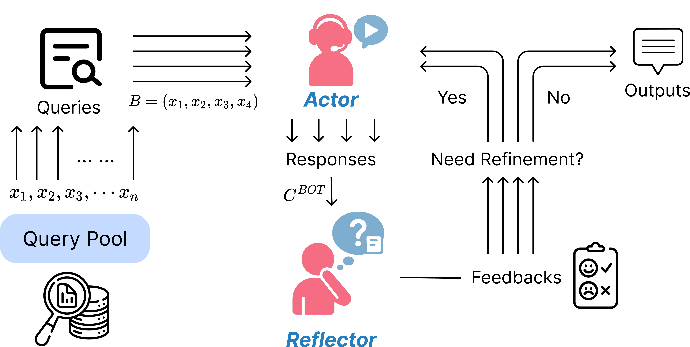

This repository contains the implementation for the paper:

**Batch-of-Thought: Cross-Instance Learning for Enhanced LLM Reasoning**

*Xuan Yang, Furong Jia, Roy Xie, Xiong Xi, Hengwei Bian, Jian Li, Monica Agrawal*

*ByteDance Inc. & Duke University*

---

## Overview

Current LLM reasoning systems process queries independently, discarding valuable cross-instance signals such as shared reasoning patterns and consistency constraints. **Batch-of-Thought (BoT)** is a training-free method that processes related queries jointly to enable cross-instance learning. We instantiate BoT within a multi-agent reflection architecture (**BoT-R**), where a Reflector performs joint evaluation to unlock mutual information gain unavailable in isolated processing.

<p align="center">
  
</p>


## Repository Structure

```
BoT/
├── open_src_runner/          # Open-source implementation
│   ├── runner_pipeline/
│   │   ├── main.py           # Main pipeline (ActorRefinementPipeline)
│   │   ├── actor_refinement.py  # Actor & Reflector logic, prompts
│   │   ├── dataloader.py     # Dataset loaders (HuggingFace) + custom dataset interface
│   │   ├── evaluate.py       # Evaluation metrics
│   │   ├── batching.py       # Batch construction (sequential/random/k-means)
│   │   └── model.py          # Supported model definitions
│   ├── example_run.sh        # Example run scripts
│   └── README.md
├── assets/                   # Figures
└── requirements.txt
```

## Installation

```bash
git clone https://github.com/xuanyang19/BoT.git
cd BoT
pip install -r requirements.txt
```

**Additional dependencies** (for k-means batching):
```bash
pip install torch transformers scikit-learn scipy
```

## Quick Start

### 1. Set your API key

```bash
export OPENAI_API_KEY="your-api-key-here"
```

### 2. Run BoT-R

```bash
cd open_src_runner/runner_pipeline

# Run on MedQA (default)
python main.py --dataset medqa --split test --batch_size 8

# Run on Winogrande with a subset
python main.py --dataset winogrande --split test --batch_size 4 --limit 100
```

## Usage

```bash
python main.py \
  --dataset <dataset> \
  --split <split> \
  --batch_size <N> \
  --model <model_name> \
  --batching <strategy> \
  --out_dir <output_dir> \
  --limit <max_examples> \
  --seed <random_seed> \
  --use_tools
```

### Arguments

| Argument | Default | Description |
|----------|---------|-------------|
| `--dataset` | `medqa` | Dataset: `medqa`, `winogrande` (extensible via `dataloader.py`) |
| `--split` | `test` | Data split: `train`, `dev`, `test` |
| `--batch_size` | `8` | Number of queries per batch |
| `--model` | `gpt-4o-2024-11-20` | LLM model name |
| `--batching` | `sequential` | Batching strategy: `sequential`, `random`, `kmeans` |
| `--embed_cache` | `None` | Path to cache embeddings (for k-means) |
| `--out_dir` | `temp` | Output directory |
| `--limit` | `None` | Max number of examples to process |
| `--seed` | `42` | Random seed |
| `--use_tools` | `False` | Enable external search tools |

## Supported Benchmarks

| Benchmark | Task | Type |
|-----------|------|------|
| [MedQA](https://huggingface.co/datasets/GBaker/MedQA-USMLE-4-options) | Medical QA (USMLE) | Multiple choice (A–D) |
| [Winogrande](https://huggingface.co/datasets/winogrande) | Commonsense reasoning | Binary choice |

Additional benchmarks (PubMedQA, GPQA, SMS Spam, Seller Fraud Detection) are reported in the paper. See `dataloader.py` for the custom dataset interface to add your own datasets.

## Output Format

Results are saved to `<out_dir>/<dataset>_<split>_reflect_<batch_size>_<timestamp>/`:

```
output_directory/
├── ckpt_20pct_*.json      # 20% progress checkpoint
├── ckpt_40pct_*.json      # 40% progress checkpoint
├── ckpt_60pct_*.json      # 60% progress checkpoint
├── ckpt_80pct_*.json      # 80% progress checkpoint
├── ckpt_final.json        # Final results
├── conversations.jsonl    # Full conversation histories
└── reflections.jsonl      # Reflection feedback histories
```

Each checkpoint contains:
- **Accuracy metrics**: `original_acc` (first attempt), `final_acc` (after refinement), `best_acc`
- **Per-item results**: answers, reasoning, confidence scores
- **Reflection traces**: trigger decisions, feedback, suggestions
- **Cost statistics**: tool call counts, usage rates

## Method

BoT-R operates in three stages:

1. **Actor**: Generates answer-rationale pairs for a batch of queries, optionally using external tools.
2. **Reflector**: Jointly evaluates all responses through comparative analysis — identifying inconsistencies, extracting shared domain knowledge, and suggesting refinements.
3. **Conditional Refinement**: Only items flagged by the Reflector are re-evaluated with targeted feedback (up to 8 rounds).

By treating queries as a cohort rather than independent instances, BoT enables:
- **Cross-instance consistency checks** — detecting errors through comparison
- **Reasoning pattern propagation** — transferring validated knowledge across instances
- **Distributional uncertainty calibration** — more reliable confidence estimates
- **Cost amortization** — one joint reflection call replaces N independent ones

## Adding Custom Datasets

1. Add a loader function in `dataloader.py`
2. Add an evaluator in `evaluate.py`
3. Update the routing logic in both files

## Adding Custom Models

Edit `runner_pipeline/model.py` to add your model to `SUPPORTED_MODELS`.

## Citation

```bibtex
@article{yang2026batch,
  title={Batch-of-Thought: Cross-Instance Learning for Enhanced LLM Reasoning},
  author={Yang, Xuan and Jia, Furong and Xie, Roy and Xi, Xiong and Bian, Hengwei and Li, Jian and Agrawal, Monica},
  journal={arXiv preprint arXiv:2601.02950},
  year={2026}
}
```

